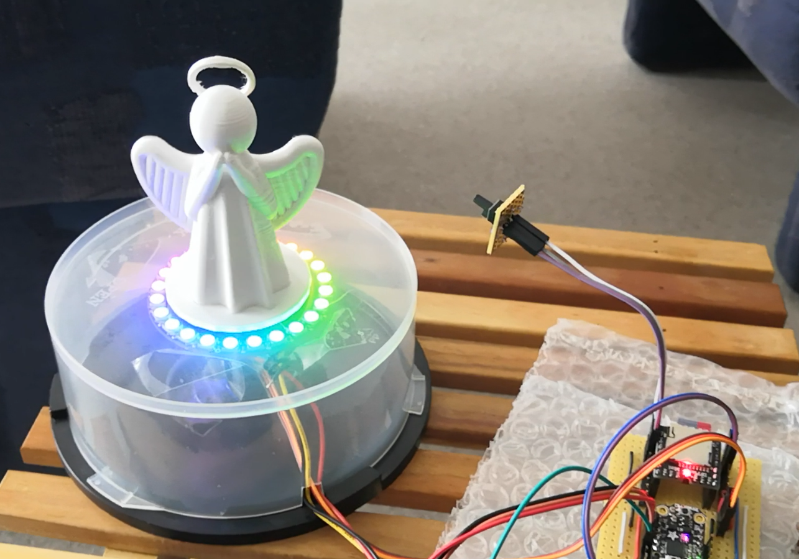
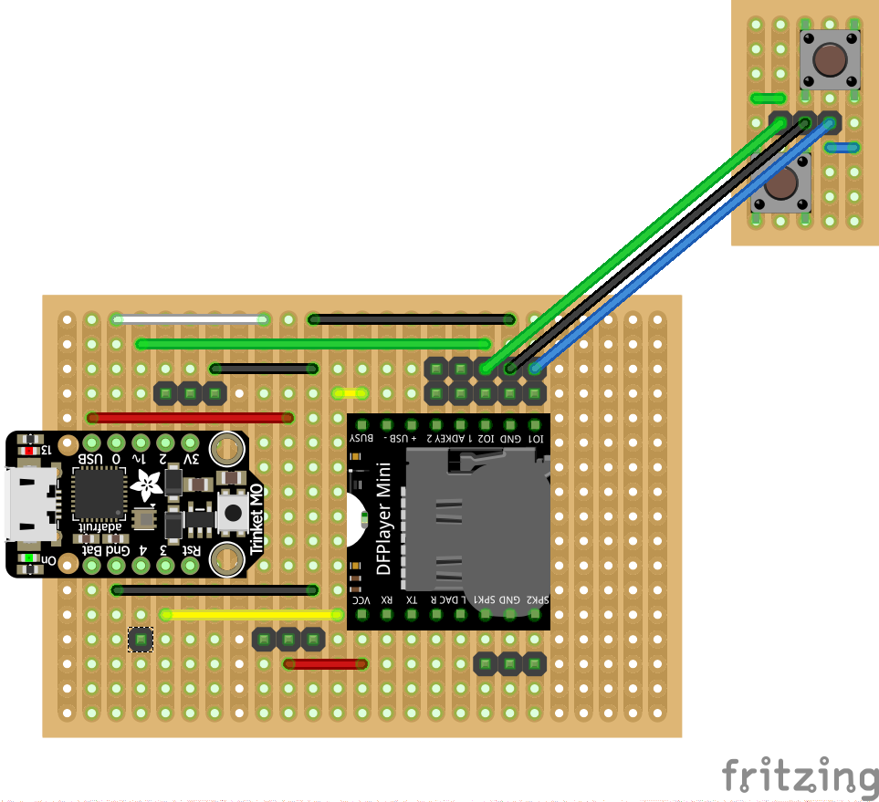
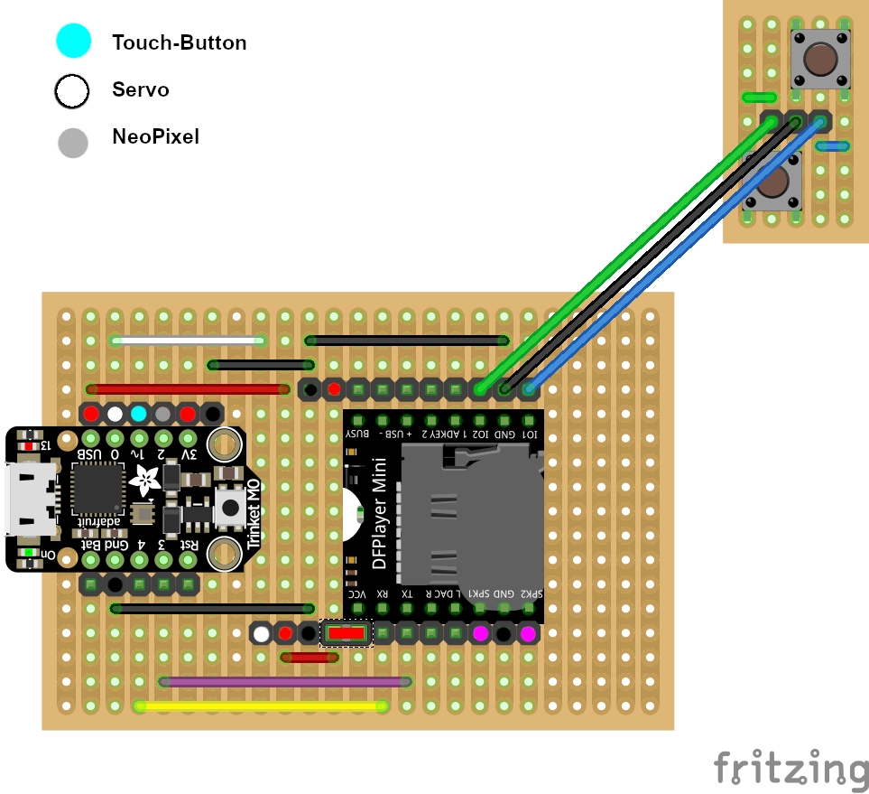

A music box for Christmas
=========================

This is a music box for Christmas with lights, a turning figure and 
music: 

It is  based on the following components:

  - Trinket-M0 (microcontroller running CircuitPython)
  - a NeoPixels-ring
  - a DFPlayer-Mini (simplistic MP3-player)
  - a servo motor
  - a wire connected to conductive material (I'm using a 5-Euro-cent)

Hardware
--------

The M0 controls the NeoPixel-ring and starts the continuous server-motor as well as
the player. Two additional buttons are directly attached to the player to let
the user control the volume and skip to the next or previous song.

Software
--------

You need the following CircuitPython-libs from the library-bundle:

  - neopixel
  - adafruit_motor

Simple Implementation
---------------------

The simple implementation will run some light effects, start the servo-motor
and play the songs on the SD-Card. The M0 will monitor the busy-state of the
player and skip to the next song after a song has finished.

The touch-button stops the lights and the motor. The currently playing song keeps on
playing until it has finished. Another touch starts everything again.

Used M0-Pins:

  - 0: PWM for the servo-motor
  - 1: Attached to the next/vol+-pin of the player
  - 2: Data-pin of the NeoPixel-ring
  - 3: Attached to the busy-pin of the player
  - 4: Configured as capacitive input-button for turning everything on and off

Copy the contents of the directory `simple/files` to your Trinket and add the
required libraries.

In `simple/doc` you will find the required wiring.

Uart Implementation
-------------------

The uart implementation will run some light effects, start the servo-motor
and play the songs on the SD-Card. The M0 communicates with the player using
the uart.

In contrast to the simple implementation, this version will also pause the music
instantly once the touch-button is "pressed". A second touch will restart the motor and
the neopxiels and continue playing the song.

The uart implementation uses a stripped down version of my dfplayer-library for CircuitPython.

Used M0-Pins:

  - 0: PWM for the servo-motor
  - 1: Configured as capacitive input-button for turning everything on and off
  - 2: Data-pin of the NeoPixel-ring
  - 3: uart-RX
  - 4: uart-TX

Copy the contents of the directory `uart/files` to your Trinket and add the
required libraries.

In `uart/doc` you will find the required wiring.

Notes
-----

You really have to play around with the throttle-values for servo-motor. They
depend on your power supply and the load you put on the motor.

In the Fritzing diagrams the DFPlayer-mini is one row wider than in reality.
I can't tell if this is an error of the Fritzing-part or if there are
different versions of the player around.
